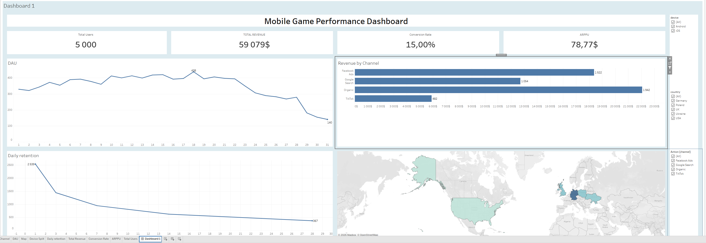

# 📊 Mobile Game Product Analysis: From Data Generation to Tableau Dashboard

### [🔗 View Interactive Dashboard on Tableau Public](https://public.tableau.com/views/MobileGamePerformanceDashboard_17791201514170/Dashboard1?:language=en-US&:sid=&:redirect=auth&:display_count=n&:origin=viz_share_link)

## 🎯 Project Overview
This project simulates the end-to-end workflow of a Product Data Analyst in the gaming industry. It covers the entire pipeline: generating synthetic user data, processing it via SQL for deep insights, and building a professional dashboard to visualize key business metrics.

## 🛠 Tech Stack
* **Python (Pandas, NumPy)**: Developed a custom script to generate a realistic dataset of 5,000 users, including event logs and purchase transactions with simulated churn and conversion rates.
* **PostgreSQL (DBeaver)**: Designed the database schema and authored complex analytical queries using CTEs, Window Functions, and Joins.
* **Tableau**: Created a comprehensive, interactive dashboard featuring KPI tiles and dynamic filters.

## 📈 Key Insights & Metrics Calculated
* **Retention Rate (Day 1, 7, 28)**: Analyzed user stickiness and identified drop-off points.
* **Monetization Metrics**: Calculated **ARPPU** (Average Revenue Per Paying User) and **Conversion Rate** from free to paid users.
* **User Segmentation**: Categorized the audience into "Whales," "Dolphins," and "Minnows" based on spending behavior.
* **DAU (Daily Active Users)**: Visualized daily activity trends to track product health.

## 💡 Technical Challenges Overcome
* **Fan-out Effect Resolution**: Solved the issue of data duplication during many-to-many joins in Tableau by implementing **LOD (Level of Detail) expressions** using the `FIXED` function.
* **Data Consistency**: Ensured accurate cross-table calculations by handling synthetic timestamps and unique identifiers across three distinct datasets.

## 🖼 Dashboard Preview

---
**Author:** Volodymyr Voldymyrovych Sologub  
**Role:** Junior Data Analyst  
**Connect with me:** [LinkedIn](www.linkedin.com/in/volodymyrsologub)
